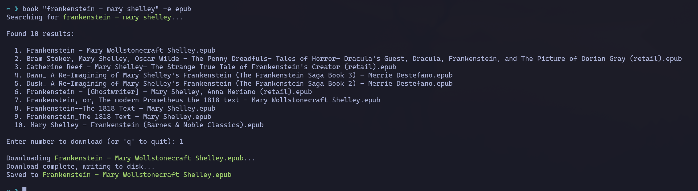

# book

A command-line tool for searching and downloading ebooks (via IRC + DCC).



## Disclaimer

This tool is provided for educational purposes and for downloading legally available content only. Users are solely responsible for ensuring they have the right to download any content they access. The author does not condone or encourage copyright infringement.

## Installation

```bash
go install github.com/liamg/book@latest
```

## Usage

```bash
# Search for a book (searches IRC Highway by default)
book frankenstein

# Filter by file extension
book -e epub "oliver twist"

# Use Undernet
book -u dracula  # Use Undernet instead of default (useful if no results found on default server)

```

### Options

| Flag | Description |
|------|-------------|
| `-e, --ext` | Limit results to specific file extension(s), e.g. `epub` |
| `-s, --server` | IRC server address (default: `irc.irchighway.net`) |
| `-p, --port` | IRC server port (default: `6667`) |
| `-c, --channel` | IRC channel to join (default: `#ebooks`) |
| `-u, --undernet` | Use Undernet IRC network (`irc.undernet.org #bookz`) |
| `-o, --output` | Output file path |

## How it works

1. Connects to an IRC server and joins an ebook channel
2. Sends a search query using the `@search` command
3. Receives search results via DCC
4. Displays results and prompts for selection
5. Downloads the selected file via DCC
